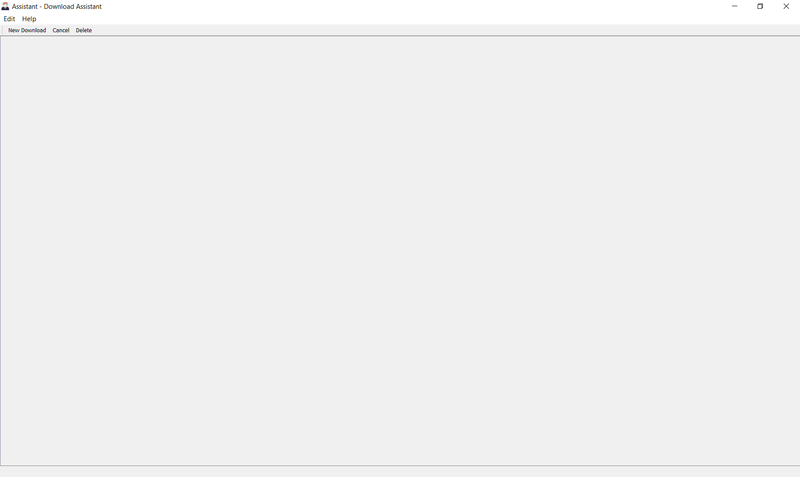
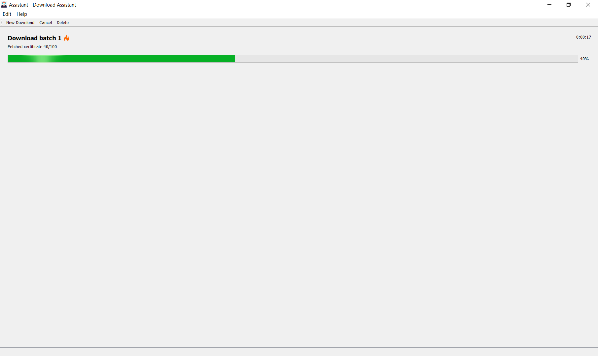

# Assistant
### Download Assistant for high school certificates

Assistant is a library and a graphic interface to facilitate the parallel download of data from high school certificates.

 

 

This program is distributed under the guidelines of GNU 2.0 licence, for more information, please refer to [Free Software Foundation](https://www.gnu.org/licenses/old-licenses/gpl-2.0.html) 

